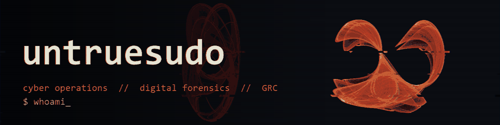

```console
$ whoami
untruesudo — B.S. Cyber Operations, University of Arizona
$ cat currently.txt
learning python · building generative visuals
$ ls interests/
cyber-operations  digital-forensics  grc-policy
```
## 🌀 Featured

**[Strange Attractor Visualizer](https://untruesudo.github.io/strange-attractor/)**
Clifford, Peter de Jong and Bedhead attractors rendered in the browser with log-density shading. Vanilla JS, zero dependencies. [Source](https://github.com/untruesudo/strange-attractor)

## 🧰 Toolbox


